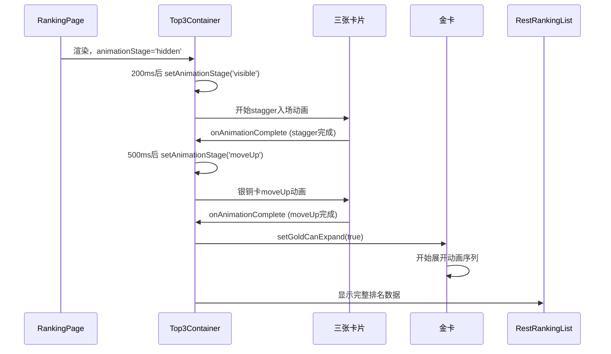
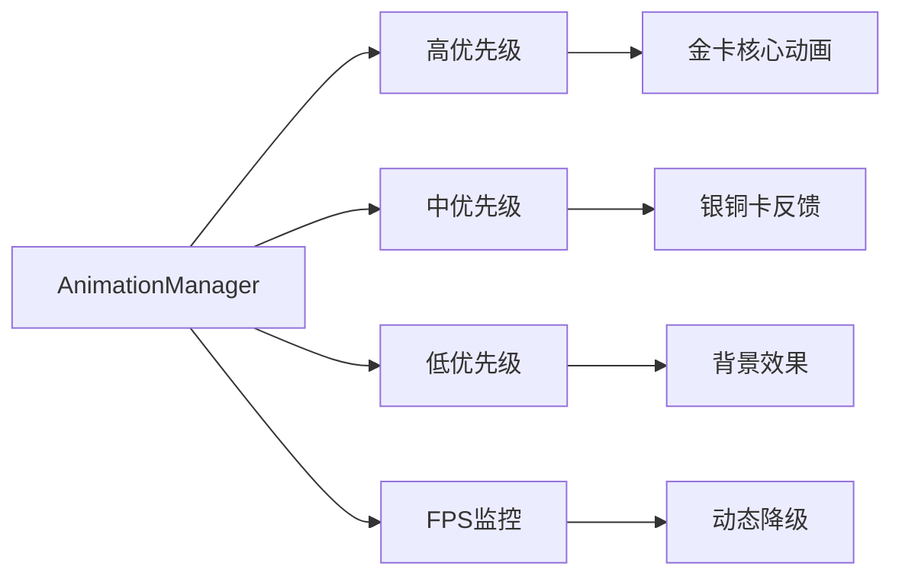

# 金银铜卡片动画和排名区域修复设计方案

## 概述

当前存在两个关键问题：
1. 金银铜三张卡片的基础出现、移动、展开动画逻辑有问题
2. RestRankingList只显示了两条排名信息而不是完整的排名列表

本设计方案专注于修复这些核心功能问题。

## 技术背景

### 当前技术栈
- **前端框架**: Next.js 15+ + React 19+
- **动画库**: Framer Motion + GSAP
- **状态管理**: Zustand
- **样式**: Tailwind CSS（容器查询，禁用px单位）
- **性能优化**: AnimationManager、性能监控系统

### 性能约束
- 维持现有的性能优化架构
- 保留AnimationManager统一管理
- 确保FPS稳定在60fps以上
- 不破坏ElectricBorder的优化效果

## 问题分析

### 核心问题定位

1. **卡片动画序列问题**
   - ❌ Top3Container动画状态管理混乱
   - ❌ onAnimationComplete回调逻辑有问题
   - ❌ 银卡和铜卡的animate属性配置错误
   - ❌ 金卡展开触发时机不对

2. **RestRankingList数据问题**
   - ❌ 只显示2条记录（第4名和第5名）
   - ❌ 应该显示更多排名数据
   - ❌ rankingData数组只有5条数据，slice(3)后只剩2条

3. **动画时序问题**
   - ❌ handleStaggerComplete和handleMoveUpComplete调用时机错乱
   - ❌ animationStage状态转换逻辑有问题
   - ❌ goldCanExpand触发时机不准确

## 架构设计

### 动画时序架构



### 性能管理架构



## 修复方案

### 1. Top3Container动画时序修复

#### 问题现状
- handleStaggerComplete和handleMoveUpComplete回调混乱
- 银卡和铜卡的animate属性重复设置
- 动画完成回调被多次触发

#### 修复方案
```typescript
// 修复Top3Container.tsx中的动画状态管理
export default function Top3Container({ data }: Top3ContainerProps) {
  const [goldCanExpand, setGoldCanExpand] = useState(false);
  const [animationStage, setAnimationStage] = useState('hidden');
  const [showWarpAnimation, setShowWarpAnimation] = useState(false);
  const [staggerCompleted, setStaggerCompleted] = useState(false);
  const [moveUpCompleted, setMoveUpCompleted] = useState(false);

  useIsomorphicLayoutEffect(() => {
    // 启动动画序列
    const timer = setTimeout(() => {
      console.log('Starting card animation sequence');
      setAnimationStage('visible');
    }, 200);
    return () => clearTimeout(timer);
  }, []);

  const handleStaggerComplete = () => {
    if (staggerCompleted) return; // 防止重复触发
    setStaggerCompleted(true);
    console.log('Stagger animation completed, starting moveUp');
    
    setTimeout(() => {
      setAnimationStage('moveUp');
    }, 500);
  };
  
  const handleMoveUpComplete = () => {
    if (moveUpCompleted) return; // 防止重复触发
    setMoveUpCompleted(true);
    console.log('MoveUp animation completed, enabling gold expansion');
    
    setGoldCanExpand(true);
    setTimeout(() => setShowWarpAnimation(true), 1000);
  };

  return (
    <WarpBackground enabled={showWarpAnimation}>
      <motion.div 
        variants={containerVariants}
        initial="hidden"
        animate={animationStage}
        onAnimationComplete={(definition) => {
          console.log('Container animation complete:', definition);
          if (definition === 'visible' && !staggerCompleted) {
            handleStaggerComplete();
          }
        }}
      >
        {/* 银卡 - 移除重复的animate属性 */}
        <motion.div 
          variants={cardVariants} 
          onAnimationComplete={(definition) => {
            if (definition === 'moveUp' && !moveUpCompleted) {
              handleMoveUpComplete();
            }
          }}
        >
          <TiltedSilverCard {/* props */} />
          <motion.div variants={valueVariants}>
            <ValueBox value={data.silver.value} type="silver" />
          </motion.div>
        </motion.div>

        {/* 金卡 - 移除style中的内联动画 */}
        <motion.div variants={cardVariants} className="relative z-10">
          <TiltedGoldCard
            goldCanExpand={goldCanExpand}
            expandedCardData={{/* data */}}
            {/* 其他props */}
          />
        </motion.div>

        {/* 铜卡 - 移除重复的animate和onAnimationComplete */}
        <motion.div variants={cardVariants}>
          <TiltedBronzeCard {/* props */} />
          <motion.div variants={valueVariants}>
            <ValueBox value={data.bronze.value} type="bronze" />
          </motion.div>
        </motion.div>
      </motion.div>
    </WarpBackground>
  );
}
```

### 2. RestRankingList数据修复

#### 问题现状
- 只显示2条排名记录（第4名、第5名）
- 缺少足够的测试数据

#### 修复方案
```typescript
// 修复 app/ranking/page.tsx 中的数据
export default function RankingPage() {
  // 扩展排名数据，提供更多测试数据
  const rankingData: RankingData[] = [
    { rank: 1, name: '宝儿', coins: 836669 },
    { rank: 2, name: '雪儿', coins: 797145 },
    { rank: 3, name: '小美', coins: 654321 },
    { rank: 4, name: '小红', coins: 543210 },
    { rank: 5, name: '小明', coins: 432109 },
    { rank: 6, name: '小丽', coins: 398765 },
    { rank: 7, name: '小强', coins: 356789 },
    { rank: 8, name: '小华', coins: 298456 },
    { rank: 9, name: '小芳', coins: 267890 },
    { rank: 10, name: '小刚', coins: 234567 },
    { rank: 11, name: '小梅', coins: 198234 },
    { rank: 12, name: '小军', coins: 167543 },
    { rank: 13, name: '小燕', coins: 145678 },
    { rank: 14, name: '小波', coins: 123456 },
    { rank: 15, name: '小琳', coins: 98765 },
    { rank: 16, name: '小东', coins: 87654 },
    { rank: 17, name: '小西', coins: 76543 },
    { rank: 18, name: '小南', coins: 65432 },
    { rank: 19, name: '小北', coins: 54321 },
    { rank: 20, name: '小中', coins: 43210 }
  ];

  // 准备剩余排名数据（从第4名开始）
  const restRankingData = rankingData.slice(3).map((item, index) => ({
    rank: item.rank, // 使用原始rank，不要重新计算
    name: item.name,
    coinAmount: item.coins,
    monthOverMonth: Math.random() > 0.3 ? (Math.random() - 0.5) * 40 : undefined,
    yearOverYear: Math.random() > 0.2 ? (Math.random() - 0.5) * 60 : undefined,
    liveDuration: Math.random() > 0.1 ? Math.random() * 200 : undefined
  }));

  console.log('RestRankingList data:', restRankingData.length, 'items');
  
  return (
    <div className="h-full w-full overflow-hidden flex flex-col">
      <div className="flex-[35] w-full @container" style={{ overflow: 'visible' }}>
        <Top3Container data={top3Data} />
      </div>
      <div className="flex-[65] w-full bg-[#060010] overflow-hidden">
        <RestRankingList
          items={restRankingData}
          thresholdValue={100000} // 调整门槛值到合理范围
          liveDurationThreshold={100}
          className="h-full"
        />
      </div>
    </div>
  );
}
```

### 3. 动画variants配置修复

#### 问题现状
- cardVariants的moveUp状态配置有问题
- 金卡的内联样式干扰了动画

#### 修复方案
```typescript
// 修复cardVariants配置
const cardVariants: Variants = {
  hidden: { opacity: 0, y: 40, scale: 0.9 },
  visible: {
    opacity: 1,
    y: 0,
    scale: 1,
    transition: {
      type: 'spring',
      damping: 15,
      stiffness: 100,
    },
  },
  moveUp: {
    opacity: 1,
    y: '-3vh', // 银卡和铜卡向上移动
    scale: 1,
    transition: {
      type: 'spring',
      damping: 15,
      stiffness: 100,
      delay: 0.2, // 增加延迟确保visible动画完成
    },
  }
};

// 金卡特殊variants（不参与moveUp）
const goldCardVariants: Variants = {
  hidden: { opacity: 0, y: 40, scale: 0.9 },
  visible: {
    opacity: 1,
    y: '-1vh', // 金卡始终比银铜卡高
    scale: 1.05, // 金卡稍大
    transition: {
      type: 'spring',
      damping: 15,
      stiffness: 100,
    },
  },
  moveUp: {
    opacity: 1,
    y: '-1vh', // 保持位置不变
    scale: 1.05,
    transition: {
      type: 'spring',
      damping: 15,
      stiffness: 100,
    },
  }
};

// 在组件中使用
{/* 金卡使用特殊variants */}
<motion.div variants={goldCardVariants} className="relative z-10">
  <TiltedGoldCard
    goldCanExpand={goldCanExpand}
    // 移除内联style中的动画属性
  />
</motion.div>
```

### 4. 金卡展开触发时机修复

#### 问题现状
- goldCanExpand设置时机不准确
- 需要等待所有前置动画完成

#### 修复方案
```typescript
// 在TiltedGoldCard中添加状态检查
const startAutoExpansion = async () => {
  // 添加额外的状态检查
  if (!goldCanExpand) {
    console.log('Gold expansion not enabled yet, waiting...');
    return;
  }
  
  console.log('Starting gold card expansion animation');
  
  // 确保DOM已稳定
  await new Promise(resolve => setTimeout(resolve, 100));
  
  // 检查资源就绪
  const resourcesReady = await checkResourcesReady();
  if (!resourcesReady) {
    console.warn('Some resources failed to load, but continuing animation');
  }

  console.log('Resources ready, starting auto expansion animation');
  
  // 开始展开动画序列
  setIsExpanded(true);
  
  setTimeout(() => {
    setShowDetailPage(true);
  }, 300);
};

// 修复useEffect依赖
useEffect(() => {
  if (goldCanExpand) {
    console.log('Received expansion signal, starting gold card expansion animation');
    startAutoExpansion();
  }
}, [goldCanExpand, startAutoExpansion]);
```

### 5. 调试日志增强

#### 问题现状
- 缺少关键节点的调试信息
- 难以定位动画卡住的位置

#### 修复方案
```typescript
// 在Top3Container中添加详细日志
const handleStaggerComplete = () => {
  if (staggerCompleted) {
    console.warn('handleStaggerComplete called multiple times, ignoring');
    return;
  }
  
  setStaggerCompleted(true);
  console.log('✅ Stagger animation completed at:', performance.now());
  console.log('   - All cards should now be visible');
  console.log('   - Starting moveUp phase in 500ms');
  
  setTimeout(() => {
    console.log('🚀 Starting moveUp animation');
    setAnimationStage('moveUp');
  }, 500);
};

const handleMoveUpComplete = () => {
  if (moveUpCompleted) {
    console.warn('handleMoveUpComplete called multiple times, ignoring');
    return;
  }
  
  setMoveUpCompleted(true);
  console.log('✅ MoveUp animation completed at:', performance.now());
  console.log('   - Silver and bronze cards moved up');
  console.log('   - Enabling gold card expansion');
  
  setGoldCanExpand(true);
  
  setTimeout(() => {
    console.log('🌟 Starting warp background animation');
    setShowWarpAnimation(true);
  }, 1000);
};

// 在TiltedGoldCard中添加日志
useEffect(() => {
  console.log('🏆 Gold card goldCanExpand changed:', goldCanExpand);
  if (goldCanExpand) {
    console.log('   - Starting gold card expansion sequence');
    startAutoExpansion();
  }
}, [goldCanExpand]);

// 在RestRankingList中添加数据日志
console.log('📋 RestRankingList received items:', {
  count: items.length,
  firstItem: items[0],
  lastItem: items[items.length - 1]
});
```

### 6. 性能监控集成

#### 动画性能监控
```typescript
// 在useAnimationManager中添加监控
const monitorAnimationPerformance = useCallback(() => {
  const stats = getStats();
  
  if (stats.fps < 50) {
    console.warn('Animation performance degraded, reducing effects');
    // 动态降级：减少电光边框效果
    setElectricIntensity(prev => Math.max(0.3, prev * 0.8));
  }
  
  if (stats.taskCount > 15) {
    console.warn('Too many animation tasks, pausing non-critical animations');
    // 暂停背景动画
    setShowWarpAnimation(false);
  }
}, [getStats]);
```

## 实现优先级

### Phase 1: 核心联动修复
1. 修复TiltedSilverCard电光边框增强
2. 修复TiltedBronzeCard电光边框增强  
3. 实现Top3Container事件广播

### Phase 2: 视觉连接
1. 实现RestRankingList前三名高亮
2. 添加连接线动画组件
3. 优化动画时序

### Phase 3: 性能优化
1. 集成性能监控
2. 实现动态降级机制
3. 优化动画内存使用

## 技术实现细节

### 事件通信机制
```typescript
// 金卡展开完成事件
const GOLD_EXPANDED_EVENT = 'goldCardExpanded';
const TOP3_COMPLETE_EVENT = 'top3AnimationComplete';

// 事件数据结构
interface AnimationEvent {
  timestamp: number;
  phase: 'gold-expanding' | 'gold-expanded' | 'complete';
  data?: any;
}
```

### 动画参数配置
```typescript
interface AnimationConfig {
  silverCard: {
    electricIntensity: { normal: 0.5, enhanced: 1.2 };
    movement: { x: 0, y: -5 };
    duration: 0.8;
  };
  bronzeCard: {
    electricIntensity: { normal: 0.5, enhanced: 1.0 };
    movement: { x: 3, y: -3 };
    duration: 1.0;
  };
  ranking: {
    highlightDelay: 500;
    pulseDuration: 1500;
    connectionFade: 1000;
  };
}
```

### 容器查询适配
```css
/* 所有新增动画元素都使用容器查询 */
.card-enhancement {
  transform: translateY(calc(-0.25cqh));
  transition: transform 0.8s cubic-bezier(0.68, -0.55, 0.265, 1.55);
}

.connection-line {
  height: calc(35cqh);
  width: calc(0.1cqw);
}

.ranking-highlight {
  border-left-width: calc(0.2cqw);
  padding-left: calc(1cqw);
}
```