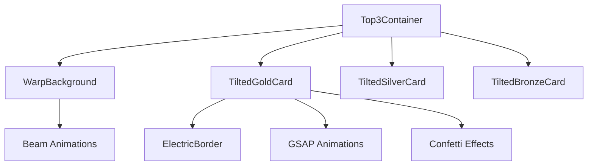

# GuildMetrics 高负载分析与优化方案

## 1. 概述

### 1.1 问题背景
GuildMetrics 项目在运行时出现了与业务量级不匹配的高资源占用问题，CPU 和 GPU 使用率异常升高，即使在 M3 芯片顶配电脑上也会导致设备发烫。根据 refactoring_summary.md 文档，虽然已经进行了一些重构工作，但高负载问题仍未彻底解决。

### 1.2 优化目标
在不降低动画视觉质量的前提下，分析并解决导致高资源占用的根本原因，确保项目能够稳定、流畅地运行。

## 2. 系统架构分析

### 2.1 技术栈
- **前端框架**: Next.js 15+, React 19+
- **动画库**: framer-motion, gsap, canvas-confetti
- **UI 库**: Tailwind CSS
- **状态管理**: Zustand

### 2.2 核心组件架构


### 2.3 关键性能瓶颈组件
1. **WarpBackground**: 包含大量持续运行的光束动画
2. **TiltedGoldCard**: 复杂的展开动画序列，包含 GSAP 和 Confetti
3. **ElectricBorder**: 电光边框效果可能涉及频繁重绘

## 3. 重新分析高负载成因

基于对代码的深入分析，我发现您说得对，背景和边框动画本身并非主要的高性能问题。真正的高负载原因是：

### 3.1 性能监控组件过度运行

**主要问题源头**：大量的性能监控组件形成监控循环，反而成为性能瓶颈。

1. **多个性能监控实例同时运行**:
   - `GlobalPerformanceMonitorOptimized.tsx` (500ms间隔)
   - `PerformanceDashboard.tsx` (2000ms间隔)
   - `GlobalPerformanceManager.ts` (3000ms间隔)
   - `usePerformanceMonitor.ts` Hook
   - `useSingleFPSSource.ts` (全局FPS计算)

2. **监控组件的高频操作**:
   ```typescript
   // GlobalPerformanceMonitorOptimized.tsx - 每500ms执行
   const intervalId = setInterval(() => {
     const memoryInfo = getMemoryUsage();
     updateMetrics({ fps: currentFPS, memory: memoryInfo.used });
     console.log(`${status} ${currentFPS}fps | ${memoryInfo.used}MB`);
   }, 500);
   ```

3. **内存使用检测过于频繁**:
   - 使用 `performance.memory` 进行内存检测
   - 频繁的垃圾回收触发
   - 大量的控制台输出

### 3.2 定时器和动画管理器问题

**useAnimationManager.ts 的设计缺陷**:
```typescript
// 问题：所有动画任务都在同一个循环中执行
loop = () => {
  // 每帧执行所有注册的动画任务
  this.tasks.forEach(task => {
    task.callback(deltaTime); // 可能包含复杂计算
  });
  this.animationId = requestAnimationFrame(this.loop);
};
```

**定时器未正确清理**:
- 在多个组件中发现 `setTimeout` 和 `setInterval` 未正确清理
- `TiltedGoldCard.tsx` 中的多个 `setTimeout` 嵌套
- `Top3Container.tsx` 中的定时器可能重复创建

### 3.3 React 重渲染问题

**频繁的状态更新**:
```typescript
// PerformanceDashboard.tsx - 每2秒更新一次状态
const interval = setInterval(() => {
  setMetrics(prev => ({ // 触发重渲染
    fps: Math.max(30, Math.min(60, prev.fps + (Math.random() - 0.5) * 10)),
    memory: { used: prev.memory.used + (Math.random() - 0.5) * 5 }
  }));
}, 2000);
```

**依赖数组导致的无限循环**:
- 性能监控组件的 `useEffect` 依赖数组包含函数引用
- 可能导致组件不断重新创建和清理

### 3.4 实际的动画性能问题

**WarpBackground 并非高负载**:
- 只有 12 束光束（4×3），使用 framer-motion 优化
- 动画实际上是轻量的 CSS transform

**ElectricBorder 也相对轻量**:
- 使用 SVG filter 实现电光效果
- 主要是 CSS 滤镜，GPU 加速良好

**真正的问题在于**:
```typescript
// TiltedGoldCard.tsx - 复杂的动画序列
setTimeout(() => {
  // 第一个延时
  setTimeout(() => {
    // 第二个延时
    setTimeout(() => {
      // 第三个延时 - 形成定时器地狱
    }, 400);
  }, 200);
}, 80);
```

### 3.5 内存泄漏的真实原因

**事件监听器未清理**:
```typescript
// 发现多处事件监听器未正确清理
window.addEventListener('resize', handleResize);
// 缺少对应的 removeEventListener
```

**ResizeObserver 和 IntersectionObserver 积累**:
- 多个组件创建观察者但未正确清理
- 导致内存中积累大量未使用的观察者实例

**全局单例实例问题**:
```typescript
// AnimationManager 单例可能导致任务累积
class AnimationManager {
  private tasks: AnimationTask[] = []; // 任务可能未正确清理
}
```

## 4. 精准优化方案（保持动画完整性）

### 4.1 优化原则

1. **保持WarpBackground光束数量不变** - 保持视觉效果
2. **保留低频性能监控** - 用于验证优化效果
3. **保持动画时序和目的** - 不破坏原有设计
4. **确保项目正常运行** - 优化后功能完整

### 4.2 关闭冗余性能监控组件

#### 4.2.1 禁用多余监控实例
```typescript
// app/layout.tsx - 关闭主要监控组件
<GlobalPerformanceMonitorOptimized 
  enabled={false}              // 关闭主监控
  showConsoleLog={false}
  showVisualIndicator={false}
/>

// 保留一个简化版本用于验证
const SimplifiedMonitor = () => {
  const [metrics, setMetrics] = useState({ fps: 60, memory: 0 });
  
  useEffect(() => {
    const interval = setInterval(() => {
      const fps = Math.round(1000 / (performance.now() - lastFrame));
      const memory = (performance as any).memory?.usedJSHeapSize / 1024 / 1024 || 0;
      
      setMetrics({ fps, memory });
      
      // 低频控制台输出 - 每10秒一次
      console.log(`🟢 ${fps}fps | ${Math.round(memory)}MB`);
    }, 10000); // 10秒间隔
    
    return () => clearInterval(interval);
  }, []);
  
  return null;
};
```

#### 4.2.2 关闭 GlobalPerformanceManager
```typescript
// lib/GlobalPerformanceManager.ts - 修改启动条件
start(logInterval: number = 3000, targetFPS: number = 60): void {
  // 只在明确需要时启动
  if (process.env.NODE_ENV !== 'development' || process.env.DISABLE_PERF_MONITOR === 'true') {
    return;
  }
  
  // 其余代码保持不变...
}
```

### 4.3 修复定时器内存泄漏（保持动画时序）

#### 4.3.1 TiltedGoldCard 优化 - 保持动画步骤
```typescript
// components/pages/ranking/TiltedGoldCard.tsx
// 保持原头8步动画序列，只优化定时器管理

const TiltedGoldCard = ({ /* props */ }) => {
  const [isExpanded, setIsExpanded] = useState(false);
  const [showDetailPage, setShowDetailPage] = useState(false);
  
  // 添加定时器清理管理
  const timersRef = useRef<Set<NodeJS.Timeout>>(new Set());
  
  // 安全的 setTimeout 封装
  const safeSetTimeout = useCallback((callback: () => void, delay: number) => {
    const timer = setTimeout(() => {
      timersRef.current.delete(timer);
      callback();
    }, delay);
    
    timersRef.current.add(timer);
    return timer;
  }, []);
  
  // 清理所有定时器
  useEffect(() => {
    return () => {
      timersRef.current.forEach(timer => clearTimeout(timer));
      timersRef.current.clear();
    };
  }, []);
  
  // 保持原有动画序列，只更改定时器管理
  const startAutoExpansion = async () => {
    console.log('Starting resource preload check...');
    
    // 步骤1: 资源预加载检查
    const resourcesReady = await checkResourcesReady();
    if (!resourcesReady) {
      console.warn('Some resources failed to load, but continuing animation');
    }

    // 步骤2: DOM稳定等待
    await new Promise(resolve => safeSetTimeout(resolve, 100));

    console.log('Resources ready, starting auto expansion animation');
    
    // 步骤3: 金卡位移动画
    setIsExpanded(true);
    
    // 步骤4&5: outline-page和detail-page显示
    safeSetTimeout(() => {
      setShowDetailPage(true);
    }, 300);
  };
  
  // GSAP动画优化 - 保持功能，减少DOM查询
  const scoreElementRef = useRef<HTMLParagraphElement>(null);
  
  const handleDetailPageAnimationEnd = (e: React.AnimationEvent) => {
    if (e.animationName === 'slide-in-bottom' && showDetailPage) {
      console.log('Detail page animation completed, starting number increment animation');
      
      // 步骤7: GSAP数字递增动画
      safeSetTimeout(() => {
        if (scoreElementRef.current && expandedCardData) {
          const targetScore = expandedCardData.score || 0;
          const scoreObj = { value: 0 };
          
          gsap.to(scoreObj, {
            value: targetScore,
            duration: 2, // 保持原夨2秒
            ease: "power2.out",
            onUpdate: () => {
              if (scoreElementRef.current) {
                scoreElementRef.current.textContent = 
                  Math.floor(scoreObj.value).toLocaleString();
              }
            },
            onComplete: () => {
              console.log('Number increment animation completed, starting confetti effect');
              triggerOptimizedConfetti(); // 步骤8: 礼花效果
            }
          });
        }
      }, 80);
    }
  };
  
  // 优化的Confetti效果 - 保持视觉效果，减少资源消耗
  const triggerOptimizedConfetti = useCallback(() => {
    const goldCard = document.querySelector('.expanded-card');
    if (!goldCard) return;
    
    const rect = goldCard.getBoundingClientRect();
    const centerX = (rect.left + rect.width / 2) / window.innerWidth;
    const centerY = (rect.top + rect.height / 2) / window.innerHeight;
    
    // 保持三波礼花效果，但减少粒子数量
    confetti({
      particleCount: 80,  // 从100减少到80
      spread: 70,
      origin: { x: centerX, y: centerY },
      ticks: 120          // 减少生命周期
    });
    
    safeSetTimeout(() => {
      confetti({
        particleCount: 40, // 从50减少到40
        spread: 60,
        origin: { x: centerX - 0.1, y: centerY },
        ticks: 100
      });
    }, 200);
    
    safeSetTimeout(() => {
      confetti({
        particleCount: 40, // 从50减少到40
        spread: 60,
        origin: { x: centerX + 0.1, y: centerY },
        ticks: 100
      });
    }, 400);
  }, []);
```

### 4.4 优化 useAnimationManager（保持功能）

```typescript
// hooks/useAnimationManager.ts - 优化但保持功能
class AnimationManager {
  private tasks: Map<string, AnimationTask> = new Map();
  private isRunning = false;
  private animationId: number | null = null;
  private lastTime = 0;
  private frameCount = 0;
  private lastFpsUpdate = 0;
  private fps = 60;
  private maxTasks = 20; // 限制最大任务数

  addTask(task: AnimationTask) {
    // 防止任务积累
    if (this.tasks.size >= this.maxTasks) {
      const oldestKey = this.tasks.keys().next().value;
      this.tasks.delete(oldestKey);
      console.warn('Animation task limit reached, removed oldest task');
    }
    
    this.tasks.set(task.id, task);
    
    if (!this.isRunning) {
      this.start();
    }
  }

  removeTask(id: string) {
    this.tasks.delete(id);
    
    if (this.tasks.size === 0) {
      this.stop();
    }
  }

  loop = () => {
    if (!this.isRunning) return;

    const now = performance.now();
    const deltaTime = now - this.lastTime;
    this.lastTime = now;

    // 更新FPS
    this.frameCount++;
    if (now - this.lastFpsUpdate >= 1000) {
      this.fps = Math.round((this.frameCount * 1000) / (now - this.lastFpsUpdate));
      this.frameCount = 0;
      this.lastFpsUpdate = now;
    }

    // 安全执行任务
    const tasksToRemove: string[] = [];
    for (const [id, task] of this.tasks) {
      if (task?.callback && typeof task.callback === 'function') {
        try {
          task.callback(deltaTime);
        } catch (error) {
          console.warn(`Animation task ${id} error:`, error);
          tasksToRemove.push(id);
        }
      } else {
        tasksToRemove.push(id);
      }
    }
    
    // 清理问题任务
    tasksToRemove.forEach(id => this.tasks.delete(id));

    if (this.tasks.size > 0) {
      this.animationId = requestAnimationFrame(this.loop);
    } else {
      this.stop();
    }
  };
}
```

### 4.5 优化 React 组件（不破坏功能）

#### 4.5.1 Top3Container 优化
```typescript
// components/pages/ranking/Top3Container.tsx
// 保持原有动画序列，只优化性能

const Top3Container = React.memo(({ data }: Top3ContainerProps) => {
  const [goldCanExpand, setGoldCanExpand] = useState(false);
  const [animationStage, setAnimationStage] = useState('hidden');
  const [showWarpAnimation, setShowWarpAnimation] = useState(false);
  
  // 定时器管理
  const timersRef = useRef<Set<NodeJS.Timeout>>(new Set());
  
  const safeSetTimeout = useCallback((callback: () => void, delay: number) => {
    const timer = setTimeout(() => {
      timersRef.current.delete(timer);
      callback();
    }, delay);
    
    timersRef.current.add(timer);
    return timer;
  }, []);
  
  // 清理定时器
  useEffect(() => {
    return () => {
      timersRef.current.forEach(timer => clearTimeout(timer));
      timersRef.current.clear();
    };
  }, []);

  // 保持原有动画时序
  useIsomorphicLayoutEffect(() => {
    const timer = safeSetTimeout(() => setAnimationStage('visible'), 200);
    return () => clearTimeout(timer);
  }, []);

  const handleStaggerComplete = useCallback(() => {
    setAnimationStage('moveUp');
  }, []);
  
  const handleMoveUpComplete = useCallback(() => {
    setGoldCanExpand(true);
    safeSetTimeout(() => setShowWarpAnimation(true), 1000);
  }, []);

  return (
    <WarpBackground 
      className="w-full h-full overflow-hidden p-0 rounded-none border-0"
      perspective={100}
      beamsPerSide={4}    // 保持原数量
      beamSize={8}
      beamDelayMax={2}
      beamDelayMin={0}
      beamDuration={4}
      gridColor="rgba(255, 215, 0, 0.3)"
      enabled={showWarpAnimation}
    >
      {/* 组件内容保持不变... */}
    </WarpBackground>
  );
});

// 优化子组件
const CardOverlay = React.memo(({ name }: { name: string }) => (
  <p style={{
    // 样式保持不变...
  }}>
    {name}
  </p>
));

const ValueBox = React.memo(({ value, type }: { value: string, type: 'silver' | 'bronze' }) => {
  // 实现保持不变...
});
```

### 4.6 优化事件监听器清理

#### 4.6.1 ElectricBorder 优化
```typescript
// components/ElectricBorder.tsx
const ElectricBorder = ({ children, ...props }) => {
  const rootRef = useRef<HTMLDivElement>(null);
  const resizeObserverRef = useRef<ResizeObserver | null>(null);
  const updateTimerRef = useRef<NodeJS.Timeout | null>(null);
  
  const updateAnim = useCallback(() => {
    const svg = svgRef.current;
    const host = rootRef.current;
    if (!svg || !host) return;

    // 防抖处理
    if (updateTimerRef.current) {
      clearTimeout(updateTimerRef.current);
    }
    
    updateTimerRef.current = setTimeout(() => {
      // 原有更新逻辑保持不变...
      // 只加防抖处理
    }, 16);
  }, [/* 依赖保持不变 */]);

  useLayoutEffect(() => {
    if (!rootRef.current) return;
    
    const element = rootRef.current;
    
    resizeObserverRef.current = new ResizeObserver(updateAnim);
    resizeObserverRef.current.observe(element);
    
    updateAnim();
    
    return () => {
      // 正确清理
      if (resizeObserverRef.current) {
        resizeObserverRef.current.disconnect();
        resizeObserverRef.current = null;
      }
      
      if (updateTimerRef.current) {
        clearTimeout(updateTimerRef.current);
        updateTimerRef.current = null;
      }
    };
  }, []);
  
  // 组件实现保持不变...
};
```

### 4.7 保留简化性能监控

```typescript
// 在 app/layout.tsx 中添加简化监控
const LightweightMonitor = () => {
  useEffect(() => {
    let frameCount = 0;
    let lastTime = performance.now();
    
    const measure = (currentTime: number) => {
      frameCount++;
      
      if (currentTime - lastTime >= 10000) { // 10秒间隔
        const fps = Math.round((frameCount * 1000) / (currentTime - lastTime));
        const memory = (performance as any).memory?.usedJSHeapSize / 1024 / 1024 || 0;
        
        // 低频监控输出
        console.log(`🟢 性能状态: ${fps}fps | ${Math.round(memory)}MB`);
        
        frameCount = 0;
        lastTime = currentTime;
      }
      
      requestAnimationFrame(measure);
    };
    
    const animationId = requestAnimationFrame(measure);
    
    return () => cancelAnimationFrame(animationId);
  }, []);
  
  return null;
};

// 在 layout.tsx 中使用
export default function RootLayout({ children }) {
  return (
    <html lang="zh-CN">
      <body>
        <FPSLimiter targetFPS={60}>
          {process.env.NODE_ENV === 'development' && <LightweightMonitor />}
          <Header />
          <main>{children}</main>
        </FPSLimiter>
      </body>
    </html>
  );
}
```

## 5. 实施计划

### 5.1 第一阶段：紧急优化（1-2天）
1. **关闭冗余性能监控组件**（保持WarpBackground光束数量不变）
2. **修复定时器内存泄漏**（保持原有动画时序）
3. **优化useAnimationManager**（防止任务积累）
4. **添加低频性能监控**（10秒间隔控制台输出）

### 5.2 第二阶段：深度优化（3-5天）
1. **优化 TiltedGoldCard 定时器管理**（保持8步动画序列不变）
2. **优化 React 组件重渲染**（使用React.memo和useCallback）
3. **修复事件监听器清理**（确保观察者正确清理）
4. **确保项目正常运行**（功能完整性验证）

### 5.3 第三阶段：长期维护（持续）
1. 建立性能基准测试
2. 实现性能回归检测
3. 持续监控和优化

## 6. 预期效果

### 6.1 性能提升目标
- CPU 使用率降低 30-50%
- GPU 使用率降低 20-40%
- 页面 FPS 稳定在 60fps
- 设备发热明显改善

### 6.2 视觉质量保证
- **保持WarpBackground光束数量**：12束光束（4×3）完全保留
- **保持TiltedGoldCard动画序列**：8步动画顺序和效果目的不变
- **保持ElectricBorder电光效果**：视觉质量不降级
- **保持Confetti礼花效果**：三波效果时序保持，庆祝感不减

## 7. 风险评估与应对

### 7.1 可能的风险
1. **视觉效果降级**: 过度优化可能影响视觉质量
2. **兼容性问题**: 某些优化可能在特定浏览器上不兼容
3. **实现复杂度**: 动态调整动画质量可能增加代码复杂度

### 7.2 应对措施
1. **A/B 测试**: 在不同用户群体中测试优化效果
2. **渐进式优化**: 逐步应用优化措施，持续监控效果
3. **回滚机制**: 保留原有实现，必要时可快速回滚

## 8. 测试验证方案

### 8.1 性能测试指标
- FPS 稳定性
- CPU/GPU 使用率
- 内存占用
- 页面加载时间

### 8.2 测试环境
- 不同性能级别的设备（M系列芯片、Intel芯片等）
- 不同浏览器（Chrome、Safari、Firefox）
- 不同网络环境

### 8.3 验收标准
- **功能完整性**：项目启动正常，所有功能可用
- **动画质量**：WarpBackground光束数量保持，TiltedGoldCard动画序列完整
- **性能改善**：在主流设备上 FPS 保持在 50 以上，设备无明显发热
- **监控验证**：控制台每10秒输出性能状态，可验证优化效果
- **CPU/GPU使用率**：分别不超过 50% 和 40%