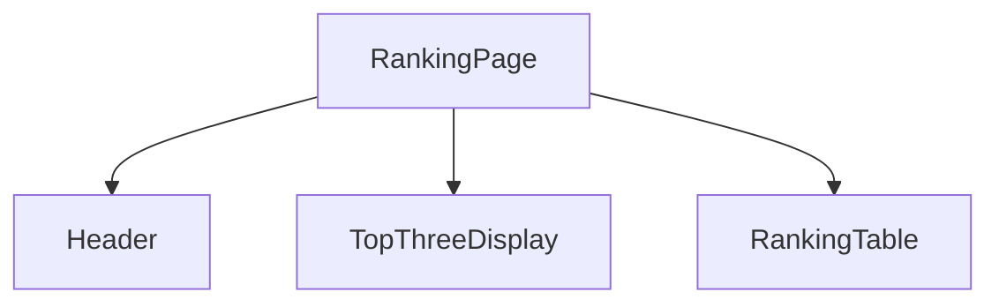

# Ranking页面样式调整设计文档

## 1. 概述

根据《设计规范.md》的要求，对现有的ranking页面进行样式调整，使其符合项目的容器自适应、相对单位和禁止溢出等核心设计原则。本次调整主要关注ranking页面，包括Header、Top 3排名卡片和其余排名表格三个主要组件。

## 2. 设计原则

### 2.1 核心设计原则
- **容器自适应**: 所有组件和元素都应基于其父容器的大小进行等比缩放，而非整个视口
- **相对单位**: 
  - 字体使用容器查询单位 `cqw` / `cqh` 作为根 `font-size` 基准
  - 组件内部所有尺寸、间距、装饰等均使用 `em` 单位
- **严格约束**:
  - 禁止固定像素单位
  - 禁止内联样式
  - 禁止溢出

### 2.2 视觉风格
- **主题**: 现代科技感与数据权威性结合
- **配色**: 深色渐变背景，金、银、铜金属质感，半透明毛玻璃效果
- **布局**: 全屏flex布局，Header占10%，Top 3占30%，其余排名表格占55%

## 3. 技术实现方案

### 3.1 整体页面结构
```tsx
// src/app/ranking/page.tsx
'use client';

import React from 'react';
import Header from '../../components/Header';
import TopThreeDisplay from '../../components/TopThreeDisplay';
import RankingTable from '../../components/RankingTable';

const RankingPage: React.FC = () => {
  return (
    <div className="h-screen flex flex-col gap-4">
      <Header />
      <div className="flex-1 flex flex-col gap-4">
        {/* 第一行：前三名主播卡片 */}
        <div className="h-[30%]">
          <TopThreeDisplay />
        </div>

        {/* 第二行：其他主播列表（固定高度，可滚动） */}
        <div className="h-[55%]">
          <RankingTable />
        </div>
      </div>
    </div>
  );
};

export default RankingPage;
```

## 3. 组件架构

### 3.1 页面结构


### 3.2 组件层级关系
1. **RankingPage** (页面根组件)
   - **Header** (导航头部)
   - **TopThreeDisplay** (前三名展示)
   - **RankingTable** (其余排名表格)

## 4. 组件详细设计

### 4.1 RankingPage 页面组件

#### 4.1.1 布局规范
- 使用 `flex flex-col` 布局占满整个屏幕 (`h-screen`)
- 组件间间距 `1rem` (`gap-4`)

#### 4.1.2 样式调整要点
- 移除Ant Design的Layout组件，使用原生HTML元素
- 使用Tailwind CSS功能类实现样式
- 应用容器查询单位实现自适应缩放

### 4.2 Header 组件

#### 4.2.1 布局规范
- 占父容器高度 `10%` (`h-[10%]`)
- 字体基准: `text-[min(1.8cqw,1.8cqh)]`

#### 4.2.2 样式调整要点
- 使用 `container-type-size` 开启容器查询上下文
- 背景使用半透明深黑色 `rgba(0, 0, 0, 0.2)` 和毛玻璃效果
- 导航按钮使用相对单位 `em`
- 月份选择器使用相对单位

#### 4.2.3 实现代码
```tsx
// src/components/Header.tsx
'use client';

import { usePageStore } from '@/store';

export default function Header() {
  const { activePage, setActivePage, selectedMonth, setSelectedMonth } = usePageStore();

  const pages = [
    { name: '排行榜', key: 'ranking' },
    { name: '数据分析', key: 'analysis' },
    { name: '数据维护', key: 'maintenance' },
  ];

  const navButtonBase = "h-[2.5em] px-[1.2em] py-[0.6em] flex items-center justify-center rounded-[0.4em] text-white text-[1em] font-semibold border border-white/20 transition-all duration-300";
  const navButtonInactive = "bg-white/10 hover:bg-white/20";
  const navButtonActive = "bg-blue-500/50 border-blue-400 shadow-[0_0_8px_rgba(59,130,246,0.7)]";

  return (
    <header className="h-[10%] flex items-center container-type-size text-[min(1.8cqw,1.8cqh)] bg-black/20 backdrop-blur-sm border border-white/10 rounded-[0.6em] p-[1em] shadow-lg">
      {/* Left: Logo and Title */}
      <div className="w-1/4 flex items-center gap-[0.8em]">
        
        <div>
          <h1 className="text-[1.2em] font-bold text-white/90">公会指标</h1>
          <p className="text-[0.9em] text-white/60">数据分析平台</p>
        </div>
      </div>
      {/* Center: Navigation */}
      <nav className="w-1/2 flex justify-center gap-[0.8em]">
        {pages.map(({ name, key }) => (
          <button
            key={key}
            onClick={() => setActivePage(key as 'ranking' | 'analysis' | 'maintenance')}
            className={`${navButtonBase} ${activePage === key ? navButtonActive : navButtonInactive}`}
          >
            {name}
          </button>
        ))}
      </nav>
      {/* Right: Month Selector */}
      <div className="w-1/4 flex justify-end">
        <select
          className="bg-black/30 border border-white/20 rounded-[0.4em] text-[1em] p-[0.5em] text-white/80 focus:outline-none focus:border-blue-500"
          value={selectedMonth}
          onChange={(e) => setSelectedMonth(e.target.value)}
        >
          <option value="2025-07">2025年7月</option>
          <option value="2025-06">2025年6月</option>
        </select>
      </div>
    </header>
  );
}
```

### 4.3 TopThreeDisplay 组件

#### 4.3.1 布局规范
- 占父容器高度 `30%` (`h-[30%]`)
- 字体基准: `text-[min(2cqw,2cqh)]`
- 三个卡片水平排列，使用 `gap-[2em]` 间距

#### 4.3.2 样式调整要点
- 卡片尺寸使用相对单位 `em`
- 使用金属质感渐变背景
- 头像使用 `/globe.svg` 占位符
- 使用 `container-type-size` 开启容器查询上下文

#### 4.3.3 实现代码
```tsx
// src/components/TopThreeDisplay.tsx
'use client';

import Image from 'next/image';
import CountUp from 'react-countup';

// Define the type for the props
type RankItem = {
  rank: number;
  name: string;
  amount: number;
  avatar: string;
};

type TopThreeDisplayProps = {
  data: RankItem[];
};

export default function TopThreeDisplay({ data }: TopThreeDisplayProps) {
  // The component now receives data via props
  const getCardClasses = (rank: number) => {
    const baseClasses = "relative w-[20em] h-[12em] rounded-[1em] p-[1em] flex flex-col items-center justify-center shadow-[inset_2px_2px_6px_rgba(255,255,255,0.4),inset_-4px_-4px_8px_rgba(0,0,0,0.2),0_8px_12px_rgba(0,0,0,0.5)] transition-transform duration-300";
    if (rank === 1) return `${baseClasses} bg-gradient-to-br from-gold-start to-gold-end z-10 scale-110`;
    if (rank === 2) return `${baseClasses} bg-gradient-to-br from-silver-start to-silver-end`;
    if (rank === 3) return `${baseClasses} bg-gradient-to-br from-bronze-start to-bronze-end`;
    return baseClasses;
  };

  const getRankText = (rank: number) => {
    if (rank === 1) return '冠军';
    if (rank === 2) return '亚军';
    if (rank === 3) return '季军';
    return '';
  }

  return (
    <div className="h-[30%] flex justify-center items-center gap-[2em] container-type-size text-[min(2cqw,2cqh)]">
      {data.map((item) => (
        <div key={item.rank} className={getCardClasses(item.rank)}>
          <div className="absolute top-[0.8em] left-[1em] text-[1.1em] font-bold text-white/80 drop-shadow-lg">
            {getRankText(item.rank)}
          </div>
          <div className="flex flex-col items-center text-white">
            <Image
              src={item.avatar}
              alt={item.name}
              width={64} height={64}
              className="w-[4em] h-[4em] rounded-full border-[0.2em] border-white/50 object-cover shadow-lg"
              onError={(e) => { e.currentTarget.src = '/globe.svg'; }} // Fallback avatar
            />
            <h3 className="mt-[0.6em] text-[1.2em] font-bold drop-shadow-md">{item.name}</h3>
            <p className="mt-[0.2em] text-[1.1em] font-bold">
              <CountUp end={item.amount} duration={2.5} separator="," prefix="¥" />
            </p>
          </div>
        </div>
      ))}
    </div>
  );
}
```

### 4.4 RankingTable 组件

#### 4.4.1 布局规范
- 占父容器高度 `55%` (`h-[55%]`)
- 字体基准: `text-[min(1.6cqw,1.6cqh)]`
- 表头固定，内容区域可垂直滚动

#### 4.4.2 样式调整要点
- 表格列宽度使用百分比: 排名(10%)、主播名(30%)、礼物价值(25%)、月度环比(17.5%)、同比增长(17.5%)
- 使用相对单位 `em` 设置内边距和间距
- 使用 `container-type-size` 开启容器查询上下文
- 背景使用半透明深黑色和毛玻璃效果

#### 4.4.3 实现代码
```tsx
// src/components/RankingTable.tsx
'use client';

// Define the type for the props
type TableItem = {
  rank: number;
  name: string;
  amount: number;
  mom_growth: number;
  yoy_growth: number; // Added
};

type RankingTableProps = {
  data: TableItem[];
};

const GrowthText = ({ value }: { value: number }) => {
  if (value === 0) {
      return <span className="font-semibold text-white/50">-</span>;
  }
  const isPositive = value > 0;
  const text = isPositive ? `+${value.toFixed(1)}%` : `${value.toFixed(1)}%`;
  const colorClass = isPositive ? "text-red-400" : "text-green-400";
  return <span className={`font-semibold ${colorClass}`}>{text}</span>;
};

export default function RankingTable({ data }: RankingTableProps) {
  return (
    <div className="h-[55%] container-type-size text-[min(1.6cqw,1.6cqh)] bg-black/20 backdrop-blur-sm border border-white/10 rounded-[0.6em] overflow-y-auto shadow-lg">
      <table className="w-full border-collapse">
        <thead className="sticky top-0 bg-black/40 backdrop-blur-md z-10">
          <tr>
            <th className="p-[0.8em] text-left w-[10%] font-semibold text-white/70">排名</th>
            <th className="p-[0.8em] text-left w-[30%] font-semibold text-white/70">主播名</th>
            <th className="p-[0.8em] text-left w-[25%] font-semibold text-white/70">礼物价值</th>
            <th className="p-[0.8em] text-left w-[17.5%] font-semibold text-white/70">月度环比</th>
            <th className="p-[0.8em] text-left w-[17.5%] font-semibold text-white/70">同比增长</th>
          </tr>
        </thead>
        <tbody>
          {data.map((item) => (
            <tr key={item.rank} className="border-t border-white/10 hover:bg-white/5 transition-colors duration-200">
              <td className="p-[0.8em] text-white/80">{item.rank}</td>
              <td className="p-[0.8em] text-white/90 font-medium">{item.name}</td>
              <td className="p-[0.8em] text-white/80">¥{item.amount.toLocaleString()}</td>
              <td className="p-[0.8em]"><GrowthText value={item.mom_growth} /></td>
              <td className="p-[0.8em]"><span className="font-semibold text-white/50">-</span></td>
            </tr>
          ))}
        </tbody>
      </table>
    </div>
  );
}
```

## 5. 数据处理

### 5.1 数据源
- 使用 `src/data/testData.ts` 中的模拟数据
- 图片和名字使用库中的占位符 `/globe.svg`

### 5.2 数据结构
```typescript
interface StreamerInfo {
  id: string;
  name: string;
  rank: number;
  giftValue: number;
  month: number;
  year: number;
  percentageOfTotal: number;
  isQualified?: boolean;
  avatar?: string;
  level?: 'TOP3' | 'HIGH' | 'MEDIUM' | 'LOW';
}
```

### 5.3 数据转换
```typescript
// 从StreamerInfo转换为RankItem
const convertToRankItem = (streamer: StreamerInfo): RankItem => ({
  rank: streamer.rank,
  name: streamer.name,
  amount: streamer.giftValue,
  avatar: streamer.avatar || '/globe.svg'
});

// 从StreamerInfo转换为TableItem
const convertToTableItem = (streamer: StreamerInfo): TableItem => ({
  rank: streamer.rank,
  name: streamer.name,
  amount: streamer.giftValue,
  mom_growth: 0, // 需要从环比数据中获取
  yoy_growth: 0  // 需要从同比增长数据中获取
});
```

## 6. 响应式设计

### 6.1 容器查询实现
- 在组件根元素上使用 `container-type: size` 开启容器查询上下文
- 字体大小使用 `text-[min(1.8cqw,1.8cqh)]` 等容器查询单位

### 6.2 相对单位使用
- 所有尺寸、间距、边框圆角等使用 `em` 单位
- 字体大小使用容器查询单位 `cqw`/`cqh`

## 7. 样式实现要点

### 7.1 禁止使用的单位和方式
- ❌ 禁止使用 `px` 固定像素单位
- ❌ 禁止使用内联样式
- ❌ 禁止元素溢出父容器边界

### 7.2 推荐的实现方式
- ✅ 使用Tailwind CSS功能类直接在TSX文件中实现样式
- ✅ 使用相对单位 `em` 和容器查询单位 `cqw`/`cqh`
- ✅ 使用 `container-type-size` 实现容器自适应

## 8. 测试验证

### 8.1 样式验证
- 验证所有组件在不同屏幕尺寸下的自适应表现
- 验证字体大小随容器变化的等比缩放效果
- 验证无元素溢出容器边界

### 8.2 功能验证
- 验证数据正确显示
- 验证状态管理功能正常
- 验证组件间交互正常

### 8.3 响应式验证
- 验证在移动设备上的显示效果
- 验证在平板设备上的显示效果
- 验证在桌面设备上的显示效果

## 9. 性能优化

### 9.1 渲染优化
- 使用React.memo优化组件重渲染
- 使用useMemo缓存计算结果
- 使用虚拟滚动优化长列表渲染

### 9.2 加载优化
- 使用代码分割减少初始加载体积
- 使用图片懒加载优化图片加载
- 使用骨架屏提升用户体验

## 10. 安全考虑

### 10.1 数据安全
- 敏感数据不直接暴露在前端
- 使用环境变量管理密钥
- 数据传输使用HTTPS加密

### 10.2 XSS防护
- 对用户输入进行严格验证
- 使用安全的DOM操作方式
- 避免使用dangerouslySetInnerHTML

## 11. 可维护性

### 11.1 代码组织
- 按功能模块化组织代码
- 使用TypeScript增强类型安全
- 遵循统一的代码风格

### 11.2 组件设计
- 组件职责单一
- Props接口明确定义
- 组件可复用性强