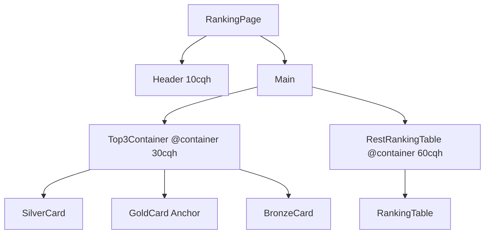
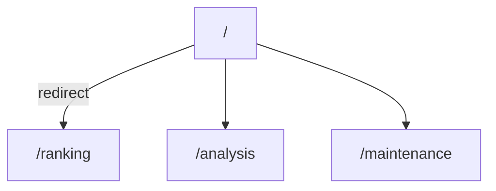

# 页面与组件层级结构

## 设计思路
页面采用 `Header + Main` 结构，`Main` 内使用 Grid 布局划分 `Top3Container` 和 `RestRankingTable` 两个主要区域。


## 代码示例
### 页面布局
```tsx
// app/layout.tsx
export default function RootLayout({children,}:{children:React.ReactNode;}) {
  return (
    <html lang="zh-CN">
      <body className="h-screen w-screen flex flex-col bg-[#0D0D0D]">
        {/* Header (B) */}
        <div className="flex-shrink-0 h-[10cqh]">
          <Header />
        </div>
        {/* Main (C) */}
        <main className="flex-1 grid grid-rows-[30cqh_60cqh] gap-6">
          {children}
        </main>
      </body>
    </html>
  );
}
```

---

# 路由结构

## 代码示例
### 重定向
```tsx
// app/page.tsx (重定向到排行榜)
import { redirect } from 'next/navigation';

export default function HomePage() {
  redirect('/ranking');
}
```

---

# header区域
## 示例代码
```tsx
// 文件路径 app/Header.tsx
// 告诉 Next.js 这是「客户端组件」，因为我们要用浏览器事件和 Zustand
'use client';

// 从刚才写的 zustand 仓库里引入钩子
import { usePageStore } from '@/store/usePageStore';
// 用来跳转路由（Next.js 15 新钩子）
import { useRouter } from 'next/navigation';
// React 的副作用钩子
import { useEffect } from 'react';

export default function Header() {
  // 取出全局状态和更新函数
  const router = useRouter();
  const { activePage, setActivePage, selectedMonth, setSelectedMonth } = usePageStore();

  // 每当 activePage 变化，就同步到浏览器地址栏（/ranking、/analysis...）
  useEffect(() => {
    router.replace(`/${activePage}`);
  }, [activePage, router]);

  // 导航按钮文字和对应 key
  const pages = [
    { name: '排行榜', key: 'ranking' },
    { name: '数据分析', key: 'analysis' },
    { name: '数据维护', key: 'maintenance' },
  ] as const;

  // 按钮基础样式（大小、圆角、过渡动画）
  const navBase =
    'h-[2.5em] min-w-[7em] px-[1.2em] py-[0.6em] flex items-center justify-center ' +
    'rounded-[0.4em] text-white text-[1em] font-semibold border-2 transition-all duration-300';
  // 未选中时的背景 + 边框颜色
  const navInactive = 'bg-white/10 border-white/20 hover:bg-white/20';
  // 选中后的高亮背景 + 发光阴影
  const navActive = 'bg-blue-500/50 border-blue-400 shadow-[0_0_8px_rgba(59,130,246,0.7)]';

  // 开始渲染
  return (
    <header className="h-[10cqh] min-h-[64px] w-full flex items-center bg-black/20 backdrop-blur-sm border border-white/10 rounded-[0.6em] p-[1em] shadow-lg">
      {/* 左侧：Logo + 标题 */}
      <div className="w-1/4 flex items-center gap-[0.8em]">
        {/* 图标 */}
        
        {/* 文字标题 */}
        <div>
          <h1 className="text-[1.2em] font-bold text-white/90">公会指标</h1>
          <p className="text-[0.9em] text-white/60">数据分析平台</p>
        </div>
      </div>

      {/* 中间：Tab 按钮区 */}
      <nav className="w-1/2 flex justify-center gap-[0.8em]" role="tablist">
        {pages.map(({ name, key }) => (
          <button
            key={key}
            role="tab"
            aria-selected={activePage === key} // 无障碍：告诉屏幕阅读器当前选中项
            onClick={() => setActivePage(key)} // 点击就把全局状态改成新页面
            className={`${navBase} ${activePage === key ? navActive : navInactive}`}
          >
            {name}
          </button>
        ))}
      </nav>

      {/* 右侧：月份下拉框 */}
      <div className="w-1/4 flex justify-end">
        <select
          id="month-select"
          name="month"
          value={selectedMonth}
          onChange={(e) => setSelectedMonth(e.target.value)} // 选中新月份 → 写进全局
          aria-label="选择月份" // 无障碍描述
          className="bg-black/30 border border-white/20 rounded-[0.4em] text-[1em] p-[0.5em] text-white/80 focus:outline-none focus:border-blue-500 appearance-none cursor-pointer"
        >
          <option value="2025-06">2025年6月</option>
          <option value="2025-07">2025年7月</option>
        </select>
      </div>
    </header>
  );
}
```

---

# top3container区域
## 设计思路
金卡 (`GoldCard Anchor`) 是视觉中心，银卡 (`SilverCard`)、铜卡 (`BronzeCard`) 以金卡为基准，实现底边对齐。布局层与视觉层彻底分离。
### 核心要点
#### 布局冻结：金卡是另外两张卡布局和对齐的基准，首先对金卡的位置进行确定，一旦确定，将不受其他设置的影响，保持在父容器中相对位置不变，其他卡片以金卡为模版进行有逻辑对应的改变。
##### 实现原理
1. **goldCardLayout.ts** 定义金卡相关**全部**常量
2. **GoldCard.tsx** 只读配置，**零魔法数字**
3. **MedalCard.tsx** = 金卡 × 比例，**不**再手写任何数字
4. 外层卡片 **绝对定位** + **底边对齐** → 布局与视觉零误差
5. 全部用 `cqh` / `cqw` 双层容器查询 → 卡片大 → 内部同步大
##### 代码示例
- 可配置常量
```ts
// app/constants/goldCardConfig.ts

/* ===== 金卡外部尺寸 ===== */
export const CARD_HEIGHT = 20; // cqh
export const CARD_WIDTH  = 16; // cqw
export const CARD_BOTTOM_OFFSET = 4; // 底边距容器底边（cqh，上下留白）

/* ===== 金卡内部格局 ===== */
export const AVATAR_SIZE = 10;   // 头像直径（cqw）
export const NAME_FONT   = 1.8;  // 名字字号（cqw）
export const VALUE_FONT  = 2.2;  // 数字字号（cqw）
export const INNER_GAP   = 1.2;  // 楼间距（cqw）

/* ===== 垂直偏移（你定） ===== */
export const AVATAR_TOP_GAP = 2; // 头像到卡片顶边（cqh）
export const NAME_GAP       = 0; // 名字到头像（cqh）
export const VALUE_GAP      = 1; // 数字到名字（cqh）

/* ===== 银/铜比例 ===== */
export const SCALE_SILVER = 0.85;
export const SCALE_BRONZE = 0.75;

/* ===== 银/铜左右位置 ===== */
export const SILVER_POSITION = 'left';  // 银卡在左
export const BRONZE_POSITION = 'right'; // 铜卡在右

/* ===== 银/铜与金卡水平间隔 ===== */
export const CARD_HORIZONTAL_GAP = 3; // cqw
```

+ 金卡组件
```tsx
// app/components/GoldCard.tsx
'use client';
import * as cfg from '@/constants/goldCardConfig';

export default function GoldCard({ item }: {
  item: { name: string; value: string; avatar: string };
}) {
  return (
    <div
      className="grid h-full w-full place-content-center"
      style={{
        gridTemplateRows: `${cfg.AVATAR_TOP_GAP}cqh ${cfg.AVATAR_SIZE}cqh ${cfg.NAME_GAP}cqh auto ${cfg.VALUE_GAP}cqh auto 1fr`,
        gap: `${cfg.INNER_GAP}cqw`,
      }}
    >
      <div className="col-start-1 row-start-2 rounded-full overflow-hidden" style={{ width: `${cfg.AVATAR_SIZE}cqw`, height: `${cfg.AVATAR_SIZE}cqw` }}>
        
      </div>
      <div className="col-start-1 row-start-4 truncate text-white text-center font-semibold" style={{ fontSize: `${cfg.NAME_FONT}cqw`, lineHeight: 1.2 }}>
        {item.name}
      </div>
      <div className="col-start-1 row-start-6 text-yellow-300 font-bold" style={{ fontSize: `${cfg.VALUE_FONT}cqw`, lineHeight: 1 }}>
        {item.value}
      </div>
    </div>
  );
}
```
- 银卡、铜卡
```tsx
// app/components/MedalCard.tsx
'use client';
import * as cfg from '@/constants/goldCardConfig';

export default function MedalCard({ item, type }: {
  item: { name: string; value: string; avatar: string };
  type: 'silver' | 'bronze';
}) {
  const scale = type === 'silver' ? cfg.SCALE_SILVER : cfg.SCALE_BRONZE;

  const avatarSize = cfg.AVATAR_SIZE * scale;
  const nameSize   = cfg.NAME_FONT * scale;
  const valueSize  = cfg.VALUE_FONT * scale;
  const gapSize    = cfg.INNER_GAP * scale;
  const offAvatar  = cfg.AVATAR_TOP_GAP * scale;
  const offName    = cfg.NAME_GAP * scale;
  const offValue   = cfg.VALUE_GAP * scale;

  return (
    <div
      className="grid h-full w-full place-content-center"
      style={{
        gridTemplateRows: `${offAvatar}cqh ${avatarSize}cqh ${offName}cqh auto ${offValue}cqh auto 1fr`,
        gap: `${gapSize}cqw`,
      }}
    >
      <div className="col-start-1 row-start-2 rounded-full overflow-hidden" style={{ width: `${avatarSize}cqw`, height: `${avatarSize}cqw` }}>
        
      </div>
      <div className="col-start-1 row-start-4 truncate text-white text-center font-semibold" style={{ fontSize: `${nameSize}cqw`, lineHeight: 1.2 }}>
        {item.name}
      </div>
      <div className="col-start-1 row-start-6 text-yellow-300 font-bold" style={{ fontSize: `${valueSize}cqw`, lineHeight: 1 }}>
        {item.value}
      </div>
    </div>
  );
}
```
- 外层布局
```tsx
// app/components/Top3Container.tsx
'use client';
import * as cfg from '@/constants/goldCardConfig';
import GoldCard from './GoldCard';
import MedalCard from './MedalCard';

export default function Top3Container({ sortedData }: {
  sortedData: { name: string; value: string; avatar: string }[];
}) {
  const silverH = cfg.CARD_HEIGHT * cfg.SCALE_SILVER;
  const silverW = cfg.CARD_WIDTH * cfg.SCALE_SILVER;
  const bronzeH = cfg.CARD_HEIGHT * cfg.SCALE_BRONZE;
  const bronzeW = cfg.CARD_WIDTH * cfg.SCALE_BRONZE;

  const silverPos = cfg.SILVER_POSITION === 'left'
    ? { left: `calc(50% + ${cfg.CARD_HORIZONTAL_GAP / 2}cqw)` }
    : { right: `calc(50% + ${cfg.CARD_HORIZONTAL_GAP / 2}cqw)` };

  const bronzePos = cfg.BRONZE_POSITION === 'left'
    ? { left: `calc(50% + ${cfg.CARD_HORIZONTAL_GAP / 2}cqw)` }
    : { right: `calc(50% + ${cfg.CARD_HORIZONTAL_GAP / 2}cqw)` };

  return (
    <div className="relative w-full h-full">
      {/* 金卡：居中 + 底边留白 */}
      <div
        className="absolute left-1/2 top-1/2 -translate-x-1/2 -translate-y-1/2"
        style={{
          height: `${cfg.CARD_HEIGHT}cqh`,
          width: `${cfg.CARD_WIDTH}cqw`,
          transform: `translate(-50%, calc(-50% - ${cfg.CARD_BOTTOM_OFFSET}cqh))`,
        }}
      >
        <GoldCard item={sortedData[1]} />
      </div>

      {/* 银卡：底边对齐 + 左右位置读配置 */}
      <div
        className="absolute bottom-0"
        style={{
          height: `${silverH}cqh`,
          width: `${silverW}cqw`,
          transform: `translateY(${cfg.CARD_BOTTOM_OFFSET}cqh)`,
          ...silverPos,
        }}
      >
        <MedalCard item={sortedData[0]} type="silver" />
      </div>

      {/* 铜卡：同上 */}
      <div
        className="absolute bottom-0"
        style={{
          height: `${bronzeH}cqh`,
          width: `${bronzeW}cqw`,
          transform: `translateY(${cfg.CARD_BOTTOM_OFFSET}cqh)`,
          ...bronzePos,
        }}
      >
        <MedalCard item={sortedData[2]} type="bronze" />
      </div>
    </div>
  );
}
```
#### 视觉层隔离：视觉样式与布局结构、卡片位置完全解耦。
##### 实现原理
